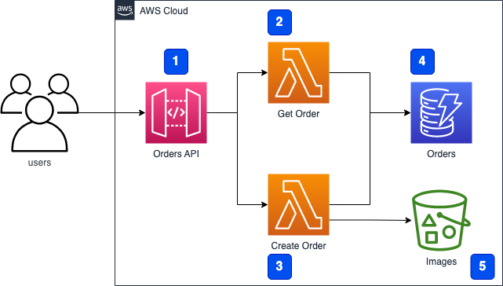

# Serverless AWS CDK Best Practices & Patterns with CDK Pipelines - Part 1

An example of creating immutable builds using the AWS CDK and progressing them through environments to production using CDK Pipelines.


The article for this repo can be found here: https://leejamesgilmore.medium.com/serverless-aws-cdk-pipeline-best-practices-patterns-part-1-ab80962f109d

Part 2 of the series can be found here:

https://blog.serverlessadvocate.com/serverless-aws-cdk-pipeline-best-practices-patterns-part-2-5446a417d232

With its own Part 2 dedicated GitHub Repo here:

https://github.com/leegilmorecode/Serverless-AWS-CDK-Best-Practices-Patterns-Part2

---

## Getting started

We are going to build the following basic application to showcase the use of CDK Pipelines:



**Note**: This is not production ready and is solely created for discussion points throughout the article.

---

## Deploying

We will deploy through the pipeline for feature-dev, staging and production, and also allow developers to use ephemeral environments based on their current pr number for quick dev environments (_as discussed in the article_).

---

### Deploying the pipeline

Firstly, we need to add the GitHub secret to AWS Secrets Manager in a secret called `github-token` as described here: https://docs.aws.amazon.com/cdk/api/v2/docs/aws-cdk-lib.pipelines.GitHubSourceOptions.html

To deploy the pipeline please run: `npm run deploy:pipeline` after adding your own account IDs in the `pipeline-types.ts` file.

Note: _to destroy please use the `npm run remove:pipeline' script_

---

### Deploying an ephemeral environment

To deploy a developer ephemeral environment:

1. Update the `.env` file and change the `PR_NUMBER` variable value.
2. Run the following command passing in your `PR_NUMBER` (example for 'PR-123' below):

```
cdk deploy ServerlessPro/Develop-PR-123/StatefulStack ServerlessPro/Develop-PR-123/StatelessStack --profile=featuredev
```

Note: _There is an example of this and the tear down in the package.json file for reference. This could easily be scripted_.

---
